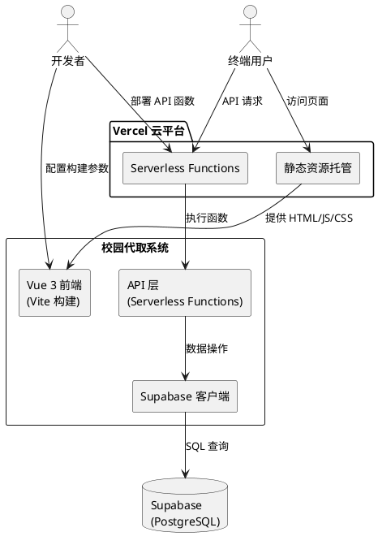
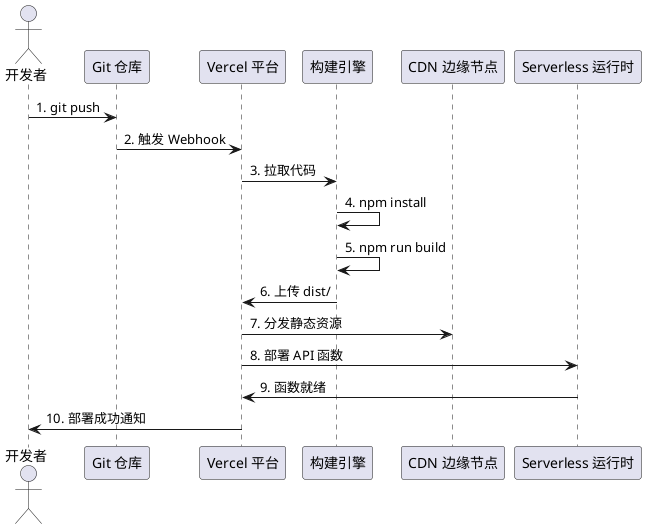

# **1. 实现模型**

## **1.1 上下文视图**



## **1.2 服务/组件总体架构**

### 目标架构（Vercel 部署后）

```
project-root/
├── api/                          # Vercel Serverless Functions
│   ├── orders/
│   │   ├── index.js              # GET/POST /api/orders
│   │   └── [id].js               # GET/PATCH/POST /api/orders/:id
│   ├── orders/
│   │   └── [id]/
│   │       ├── accept.js         # POST /api/orders/:id/accept
│   │       ├── status.js         # PATCH /api/orders/:id/status
│   │       └── cancel.js         # POST /api/orders/:id/cancel
│   ├── orders/
│   │   └── my/
│   │       ├── published.js      # GET /api/orders/my/published
│   │       └── accepted.js       # GET /api/orders/my/accepted
│   ├── admin/
│   │   ├── orders.js             # GET /api/admin/orders
│   │   ├── stats.js              # GET /api/admin/stats
│   │   └── expire-orders.js      # POST /api/admin/expire-orders
│   └── _lib/
│       ├── supabase.js           # Supabase 客户端封装
│       └── middleware.js         # 公共中间件（CORS、JSON解析）
├── src/                          # Vue 3 前端源码
│   ├── api/
│   │   └── index.js              # API 调用封装
│   ├── components/
│   ├── views/
│   ├── router/
│   ├── App.vue
│   └── main.js
├── public/
├── dist/                         # Vite 构建输出（Vercel 托管）
├── vercel.json                   # Vercel 配置文件
├── package.json                  # 合并后的依赖管理
├── vite.config.js                # Vite 配置
└── .env.example                  # 环境变量示例
```

### 组件职责划分

| 组件 | 职责 | 技术实现 |
|------|------|----------|
| **前端应用** | 用户界面渲染、路由管理、API 调用 | Vue 3 + Vite + Vue Router |
| **API 层** | 业务逻辑处理、数据验证、数据库操作 | Vercel Serverless Functions |
| **Supabase 客户端** | 数据库连接池管理、SQL 查询执行 | @supabase/supabase-js |
| **vercel.json** | 路由重写、构建配置、CORS 策略 | JSON 配置文件 |

## **1.3 实现设计文档**

### 1.3.1 Express 路由到 Serverless Functions 映射

| 原 Express 路由 | Vercel 文件路径 | HTTP 方法 |
|-----------------|-----------------|-----------|
| `POST /api/orders` | `api/orders/index.js` | POST |
| `GET /api/orders` | `api/orders/index.js` | GET |
| `GET /api/orders/:id` | `api/orders/[id].js` | GET |
| `POST /api/orders/:id/accept` | `api/orders/[id]/accept.js` | POST |
| `PATCH /api/orders/:id/status` | `api/orders/[id]/status.js` | PATCH |
| `POST /api/orders/:id/cancel` | `api/orders/[id]/cancel.js` | POST |
| `GET /api/orders/my/published` | `api/orders/my/published.js` | GET |
| `GET /api/orders/my/accepted` | `api/orders/my/accepted.js` | GET |
| `GET /api/admin/orders` | `api/admin/orders.js` | GET |
| `GET /api/admin/stats` | `api/admin/stats.js` | GET |
| `POST /api/admin/expire-orders` | `api/admin/expire-orders.js` | POST |

### 1.3.2 Serverless Function 标准模板

每个 API 文件遵循以下结构：

```javascript
// api/xxx.js
import { createClient } from '@supabase/supabase-js';
import { setCorsHeaders, parseBody } from '../_lib/middleware.js';

// 初始化 Supabase 客户端（函数级别单例）
const supabase = createClient(
  process.env.SUPABASE_URL,
  process.env.SUPABASE_ANON_KEY
);

export default async function handler(req, res) {
  // 1. 设置 CORS 头
  setCorsHeaders(req, res);

  // 2. 处理 OPTIONS 预检请求
  if (req.method === 'OPTIONS') {
    return res.status(200).end();
  }

  // 3. 解析请求体
  parseBody(req);

  // 4. 业务逻辑处理
  try {
    // ... 业务代码
  } catch (error) {
    return res.status(500).json({ error: '服务器错误' });
  }
}
```

### 1.3.3 公共中间件设计

```javascript
// api/_lib/middleware.js

/**
 * 设置 CORS 响应头
 */
export function setCorsHeaders(req, res) {
  const allowedOrigins = process.env.ALLOWED_ORIGINS?.split(',') || ['*'];
  const origin = req.headers.origin;

  if (allowedOrigins.includes('*') || allowedOrigins.includes(origin)) {
    res.setHeader('Access-Control-Allow-Origin', origin || '*');
  }

  res.setHeader('Access-Control-Allow-Methods', 'GET, POST, PATCH, OPTIONS');
  res.setHeader('Access-Control-Allow-Headers', 'Content-Type, x-admin-key');
}

/**
 * 解析请求体（Vercel 自动解析，此函数用于兼容）
 */
export function parseBody(req) {
  // Vercel Serverless Functions 自动解析 JSON 请求体
  // req.body 已可直接使用
  return req.body;
}

/**
 * 管理员认证中间件
 */
export function adminAuth(req, res) {
  const adminKey = req.headers['x-admin-key'];

  if (!adminKey || adminKey !== process.env.ADMIN_SECRET_KEY) {
    return false;
  }
  return true;
}
```

---

# **2. 接口设计**

## **2.1 总体设计**

### API 基础信息

| 项目 | 值 |
|------|-----|
| 基础路径 | `/api` |
| 数据格式 | JSON |
| 认证方式 | 管理员接口使用 `x-admin-key` 请求头 |
| CORS 策略 | 允许配置的域名列表 |

### 响应状态码规范

| 状态码 | 含义 | 使用场景 |
|--------|------|----------|
| 200 | 成功 | GET/POST/PATCH 成功 |
| 201 | 创建成功 | POST 创建资源成功 |
| 400 | 请求错误 | 参数校验失败、业务规则冲突 |
| 401 | 未授权 | 管理员认证失败 |
| 404 | 未找到 | 资源不存在 |
| 500 | 服务器错误 | 内部异常 |

## **2.2 接口清单**

### 2.2.1 订单接口

#### POST /api/orders - 发布任务

**请求体**：
```json
{
  "task_type": "快递代取",
  "pickup_location": "菜鸟驿站",
  "delivery_location": "宿舍楼A",
  "task_description": "取一个中等大小的快递",
  "reward_amount": 5,
  "publisher_contact": "13800138000",
  "expected_time": "2024-01-15T18:00:00Z",
  "notes": "备注信息"
}
```

**响应体**：
```json
{
  "message": "订单创建成功",
  "order": {
    "id": 1,
    "task_type": "快递代取",
    "status": "待接单",
    "publisher_id": "pub_1705312800000_abc123xyz",
    "created_at": "2024-01-15T10:00:00Z"
  }
}
```

#### GET /api/orders - 获取待接订单列表

**查询参数**：
| 参数 | 类型 | 必填 | 说明 |
|------|------|------|------|
| task_type | string | 否 | 任务类型筛选 |
| sort_by | string | 否 | 排序字段：reward/time |
| order | string | 否 | 排序方向：asc/desc |

**响应体**：
```json
[
  {
    "id": 1,
    "task_type": "快递代取",
    "pickup_location": "菜鸟驿站",
    "delivery_location": "宿舍楼A",
    "reward_amount": 5,
    "expected_time": "2024-01-15T18:00:00Z",
    "created_at": "2024-01-15T10:00:00Z",
    "status": "待接单"
  }
]
```

#### GET /api/orders/:id - 获取订单详情

**响应体**：
```json
{
  "id": 1,
  "task_type": "快递代取",
  "pickup_location": "菜鸟驿站",
  "delivery_location": "宿舍楼A",
  "task_description": "取一个中等大小的快递",
  "reward_amount": 5,
  "publisher_contact": "***",
  "expected_time": "2024-01-15T18:00:00Z",
  "notes": "备注信息",
  "status": "已接单",
  "publisher_id": "pub_xxx",
  "acceptor_id": "acc_xxx",
  "acceptor_contact": "13900139000",
  "created_at": "2024-01-15T10:00:00Z",
  "accepted_at": "2024-01-15T11:00:00Z"
}
```

#### POST /api/orders/:id/accept - 接单

**请求体**：
```json
{
  "acceptor_contact": "13900139000"
}
```

**响应体**：
```json
{
  "message": "接单成功",
  "order": { /* 订单详情 */ },
  "publisher_contact": "13800138000"
}
```

#### PATCH /api/orders/:id/status - 更新订单状态

**请求体**：
```json
{
  "status": "进行中"
}
```

**状态流转规则**：
- `已接单` → `进行中`（已取件）
- `进行中` → `已完成`（已送达）

#### POST /api/orders/:id/cancel - 取消订单

**请求体**：
```json
{
  "cancel_type": "publisher"
}
```

**cancel_type 取值**：
- `publisher`：发布者取消（订单变为已取消）
- `acceptor`：接单者取消（订单恢复为待接单）

#### GET /api/orders/my/published - 获取我的发布

**查询参数**：
| 参数 | 类型 | 必填 | 说明 |
|------|------|------|------|
| publisher_id | string | 是 | 发布者ID |

#### GET /api/orders/my/accepted - 获取我的接单

**查询参数**：
| 参数 | 类型 | 必填 | 说明 |
|------|------|------|------|
| acceptor_id | string | 是 | 接单者ID |

### 2.2.2 管理员接口

所有管理员接口需要在请求头中携带 `x-admin-key`。

#### GET /api/admin/orders - 获取所有订单

**请求头**：
```
x-admin-key: your_admin_secret_key
```

**查询参数**：
| 参数 | 类型 | 必填 | 说明 |
|------|------|------|------|
| status | string | 否 | 状态筛选 |
| page | number | 否 | 页码，默认 1 |
| limit | number | 否 | 每页数量，默认 20 |

**响应体**：
```json
{
  "orders": [ /* 订单列表 */ ],
  "total": 100,
  "page": 1,
  "limit": 20
}
```

#### GET /api/admin/stats - 获取统计数据

**响应体**：
```json
{
  "total": 100,
  "pending": 20,
  "accepted": 15,
  "inProgress": 10,
  "completed": 50,
  "cancelled": 5,
  "today": 8
}
```

#### POST /api/admin/expire-orders - 清理过期订单

**响应体**：
```json
{
  "message": "过期订单已清理"
}
```

---

# **3. 数据模型**

## **3.1 设计目标**

1. **无状态设计**：Serverless Functions 不依赖本地状态，所有数据存储在 Supabase
2. **连接复用**：Supabase 客户端在函数实例级别复用，减少连接开销
3. **环境隔离**：通过环境变量区分开发/生产环境配置

## **3.2 模型实现**

### 3.2.1 环境变量模型

| 变量名 | 作用域 | 说明 |
|--------|--------|------|
| `SUPABASE_URL` | 运行时 | Supabase 项目地址 |
| `SUPABASE_ANON_KEY` | 运行时 | Supabase 匿名密钥 |
| `ADMIN_SECRET_KEY` | 运行时 | 管理员认证密钥 |
| `ALLOWED_ORIGINS` | 运行时 | CORS 允许的域名列表（逗号分隔） |
| `VITE_API_BASE_URL` | 构建时 | 前端 API 基础地址 |

### 3.2.2 vercel.json 配置模型

```json
{
  "buildCommand": "npm run build",
  "outputDirectory": "dist",
  "installCommand": "npm install",
  "framework": "vite",
  "functions": {
    "api/**/*.js": {
      "runtime": "nodejs20.x",
      "maxDuration": 10
    }
  },
  "rewrites": [
    {
      "source": "/api/(.*)",
      "destination": "/api/$1"
    },
    {
      "source": "/((?!api/).*)",
      "destination": "/index.html"
    }
  ],
  "headers": [
    {
      "source": "/api/(.*)",
      "headers": [
        { "key": "Access-Control-Allow-Origin", "value": "*" },
        { "key": "Access-Control-Allow-Methods", "value": "GET,POST,PATCH,OPTIONS" },
        { "key": "Access-Control-Allow-Headers", "value": "Content-Type,x-admin-key" }
      ]
    },
    {
      "source": "/assets/(.*)",
      "headers": [
        { "key": "Cache-Control", "value": "public, max-age=31536000, immutable" }
      ]
    }
  ]
}
```

### 3.2.3 package.json 合并模型

```json
{
  "name": "campus-delivery",
  "version": "1.0.0",
  "type": "module",
  "scripts": {
    "dev": "vite",
    "build": "vite build",
    "preview": "vite preview"
  },
  "dependencies": {
    "vue": "^3.5.25",
    "vue-router": "^4.6.4",
    "axios": "^1.13.6",
    "@supabase/supabase-js": "^2.99.0"
  },
  "devDependencies": {
    "@vitejs/plugin-vue": "^6.0.2",
    "vite": "^7.3.1"
  },
  "engines": {
    "node": ">=18.x"
  }
}
```

### 3.2.4 vite.config.js 配置模型

```javascript
import { defineConfig } from 'vite'
import vue from '@vitejs/plugin-vue'

export default defineConfig({
  plugins: [vue()],
  build: {
    outDir: 'dist',
    assetsDir: 'assets',
    sourcemap: false
  },
  server: {
    proxy: {
      '/api': {
        target: 'http://localhost:3000',
        changeOrigin: true
      }
    }
  }
})
```

---

# **4. 部署架构**

## **4.1 部署流程**



## **4.2 环境配置**

| 环境 | VITE_API_BASE_URL | 说明 |
|------|-------------------|------|
| 开发 | `http://localhost:3000/api` | 本地开发服务器 |
| 预览 | `/api` | Vercel 预览部署（相对路径） |
| 生产 | `/api` | Vercel 生产部署（相对路径） |

## **4.3 监控与日志**

1. **构建日志**：Vercel 控制台查看构建过程
2. **函数日志**：Vercel Functions 日志面板
3. **访问日志**：Vercel Analytics（需启用）
4. **错误追踪**：函数返回的结构化错误信息
