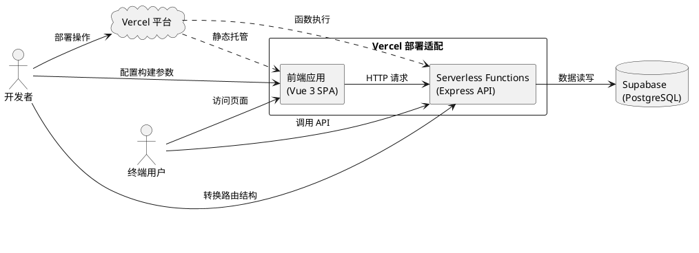
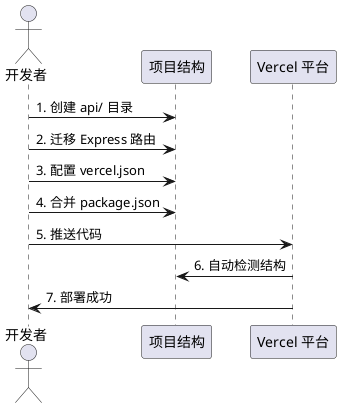
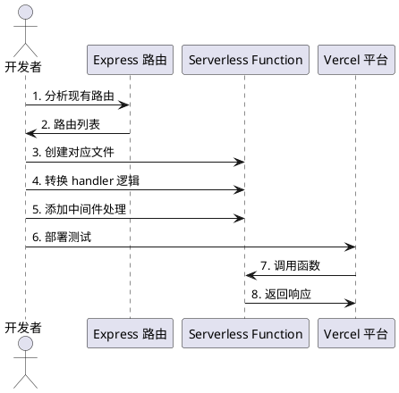
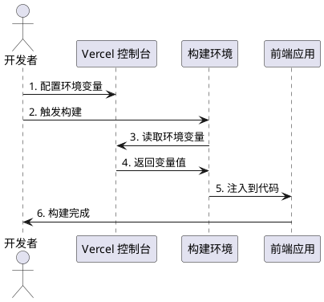
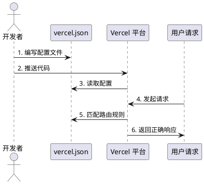

# **1. 组件定位**

## **1.1 核心职责**

本组件负责将校园代取系统适配到 Vercel 平台部署，实现前后端统一托管、自动化构建部署、环境变量管理，确保系统在 Serverless 环境下稳定运行。

## **1.2 核心输入**

1. **现有项目代码**：Vue 3 前端应用和 Express 后端 API
2. **环境变量配置**：Supabase 连接信息、管理员密钥等敏感配置
3. **Vercel 平台配置**：构建命令、输出目录、路由重写规则
4. **用户部署请求**：触发部署流程的操作指令

## **1.3 核心输出**

1. **适配后的项目结构**：符合 Vercel 部署规范的目录结构
2. **Serverless Functions**：将 Express 路由转换为 Vercel 无服务器函数
3. **vercel.json 配置文件**：定义路由、构建、环境变量等配置
4. **部署成功状态**：应用可正常访问，API 功能正常

## **1.4 职责边界**

本组件**不负责**以下事项：

1. 数据库迁移或数据迁移（继续使用 Supabase 云数据库）
2. 业务功能的新增或修改
3. Vercel 账户注册和项目创建（需用户自行完成）
4. 域名配置和 SSL 证书管理

---

# **2. 领域术语**

**Vercel Serverless Functions**
: Vercel 平台提供的无服务器计算能力，将 API 路由转换为按需执行的函数实例。

**vercel.json**
: Vercel 项目的配置文件，定义构建规则、路由重写、环境变量等部署配置。

**冷启动**
: Serverless 函数在长时间未调用后首次执行时的初始化延迟现象。

**路由重写**
: 将前端路由请求重写到 index.html，或将 API 请求代理到 Serverless Functions。

**环境变量注入**
: 在构建时或运行时将敏感配置注入应用，避免硬编码。

---

# **3. 角色与边界**

## **3.1 核心角色**

- **开发者**：执行项目适配和部署操作，配置环境变量
- **终端用户**：访问部署后的应用，使用校园代取功能

## **3.2 外部系统**

- **Vercel 平台**：提供静态资源托管和 Serverless Functions 运行环境
- **Supabase**：提供 PostgreSQL 数据库服务，存储订单数据
- **Vite 构建工具**：负责前端资源的打包和优化

## **3.3 交互上下文**

---

# **4. DFX约束**

## **4.1 性能**

1. **首屏加载时间**：必须小于 3 秒（LCP < 2.5s）
2. **API 响应时间**：P95 响应时间必须小于 500ms（不含冷启动）
3. **冷启动时间**：Serverless Function 冷启动必须小于 1 秒
4. **静态资源缓存**：JS/CSS 资源必须启用长期缓存（1年）

## **4.2 可靠性**

1. **系统可用性**：必须达到 99.9% 可用性（Vercel SLA 保证）
2. **故障恢复**：Serverless Function 必须支持自动重试
3. **数据一致性**：必须保证与 Supabase 的数据一致性

## **4.3 安全性**

1. **环境变量保护**：敏感配置必须通过 Vercel 环境变量注入，禁止硬编码
2. **API 认证**：管理员接口必须验证 x-admin-key 请求头
3. **CORS 配置**：必须限制允许的请求来源域名

## **4.4 可维护性**

1. **构建日志**：必须保留完整的构建日志用于问题排查
2. **错误追踪**：API 错误必须返回结构化的错误信息
3. **版本回滚**：必须支持一键回滚到上一个稳定版本

## **4.5 兼容性**

1. **浏览器兼容**：必须支持主流浏览器的最近两个主版本
2. **移动端适配**：必须支持 iOS Safari 和 Android Chrome
3. **API 向后兼容**：现有 API 接口签名必须保持不变

---

# **5. 核心能力**

## **5.1 项目结构重组**

### **5.1.1 业务规则**

1. **目录结构规范**：必须将后端 API 路由迁移到 `api/` 目录，符合 Vercel Serverless Functions 规范
   - 验收条件：[部署后] → [Vercel 自动识别 api/ 目录为 Serverless Functions]

2. **前端输出目录**：必须配置 Vite 构建输出到 `dist/` 目录
   - 验收条件：[执行 npm run build] → [生成 dist/ 目录包含 index.html 和静态资源]

3. **依赖管理**：必须合并前后端依赖到根目录 package.json
   - 验收条件：[npm install] → [同时安装前后端所需依赖]

4. **禁止项**：禁止在 api/ 目录中放置非 API 相关文件
   - 验收条件：[检查 api/ 目录] → [仅包含 .js/.ts API 文件]

### **5.1.2 交互流程**

### **5.1.3 异常场景**

1. **API 路由冲突**
   - 触发条件：多个 API 文件定义了相同的路由路径
   - 系统行为：Vercel 构建时报错，提示路由冲突
   - 用户感知：构建失败，错误日志显示冲突的路由

2. **依赖版本不兼容**
   - 触发条件：前后端依赖的同一包版本不一致
   - 系统行为：npm install 时报错或警告
   - 用户感知：安装失败，需手动解决版本冲突

---

## **5.2 Express 转 Serverless Functions**

### **5.2.1 业务规则**

1. **函数签名规范**：每个 API 文件必须导出默认的 handler 函数，签名为 `(req, res) => void`
   - 验收条件：[Vercel 调用 API] → [正确执行 handler 函数并返回响应]

2. **路由文件映射**：必须按照 Vercel 规则将 Express 路由映射到文件路径
   - `/api/orders` → `api/orders/index.js`
   - `/api/orders/[id]` → `api/orders/[id].js`
   - 验收条件：[访问 /api/orders] → [执行 api/orders/index.js]

3. **中间件处理**：必须在每个 handler 函数内部处理 CORS 和 JSON 解析
   - 验收条件：[发送 JSON 请求体] → [正确解析 req.body]

4. **环境变量访问**：必须使用 `process.env` 访问环境变量
   - 验收条件：[配置 Vercel 环境变量] → [API 正确读取配置值]

### **5.2.2 交互流程**

### **5.2.3 异常场景**

1. **冷启动超时**
   - 触发条件：Serverless Function 首次调用时初始化时间过长
   - 系统行为：Vercel 返回 504 Gateway Timeout
   - 用户感知：API 请求超时，需重试

2. **环境变量未配置**
   - 触发条件：API 依赖的环境变量未在 Vercel 中配置
   - 系统行为：process.env.XXX 返回 undefined，导致数据库连接失败
   - 用户感知：API 返回 500 错误，提示配置缺失

---

## **5.3 前端环境变量配置**

### **5.3.1 业务规则**

1. **API 地址配置**：必须使用 `VITE_API_BASE_URL` 环境变量配置后端 API 地址
   - 验收条件：[设置 VITE_API_BASE_URL] → [前端请求发送到正确地址]

2. **构建时注入**：Vite 环境变量必须在构建时注入，以 `VITE_` 前缀为标识
   - 验收条件：[npm run build] → [环境变量值被编译到静态文件中]

3. **默认值设置**：必须为开发环境提供默认值 `http://localhost:3000/api`
   - 验收条件：[未设置环境变量] → [使用默认本地地址]

4. **禁止项**：禁止在前端代码中硬编码生产环境 API 地址
   - 验收条件：[代码审查] → [无硬编码的生产 URL]

### **5.3.2 交互流程**

### **5.3.3 异常场景**

1. **环境变量名错误**
   - 触发条件：使用了非 `VITE_` 前缀的环境变量名
   - 系统行为：Vite 构建时忽略该变量
   - 用户感知：前端无法读取环境变量，使用默认值

2. **生产环境变量泄露到开发环境**
   - 触发条件：本地 .env 文件包含生产配置
   - 系统行为：本地开发连接到生产 API
   - 用户感知：开发环境数据污染生产数据

---

## **5.4 vercel.json 配置**

### **5.4.1 业务规则**

1. **路由重写规则**：必须配置 SPA 路由回退，将非 API 请求重写到 index.html
   - 验收条件：[访问 /publish] → [返回 index.html 而非 404]

2. **构建配置**：必须指定正确的构建命令和输出目录
   - 验收条件：[Vercel 构建] → [执行 npm run build，输出到 dist/]

3. **函数配置**：必须为 Serverless Functions 配置合理的超时时间和内存限制
   - 验收条件：[API 执行超过 10 秒] → [返回超时错误而非无限等待]

4. **CORS 头配置**：必须在 vercel.json 中配置允许的请求来源
   - 验收条件：[跨域请求] → [返回正确的 CORS 响应头]

### **5.4.2 交互流程**

### **5.4.3 异常场景**

1. **配置语法错误**
   - 触发条件：vercel.json 包含无效的 JSON 语法
   - 系统行为：Vercel 构建失败，提示 JSON 解析错误
   - 用户感知：部署失败，需修正配置文件

2. **路由规则冲突**
   - 触发条件：多个重写规则匹配同一请求路径
   - 系统行为：使用第一个匹配的规则
   - 用户感知：请求被路由到非预期的处理程序

---

# **6. 数据约束**

## **6.1 环境变量配置**

- **VITE_API_BASE_URL**：后端 API 基础地址，必须为有效的 URL 格式，生产环境必须使用 HTTPS
- **SUPABASE_URL**：Supabase 项目地址，必须为有效的 HTTPS URL
- **SUPABASE_ANON_KEY**：Supabase 匿名密钥，必须为有效的 JWT 格式字符串
- **ADMIN_SECRET_KEY**：管理员认证密钥，长度必须大于等于 16 个字符

## **6.2 构建配置**

- **buildCommand**：构建命令，必须为 `npm run build`
- **outputDirectory**：输出目录，必须为 `dist`
- **installCommand**：安装命令，必须为 `npm install`
- **framework**：框架类型，必须为 `vite`

## **6.3 Serverless Function 配置**

- **maxDuration**：最大执行时间，必须为 10 秒（Hobby 计划上限）
- **memory**：内存限制，可选值为 128MB、256MB、512MB、1024MB
