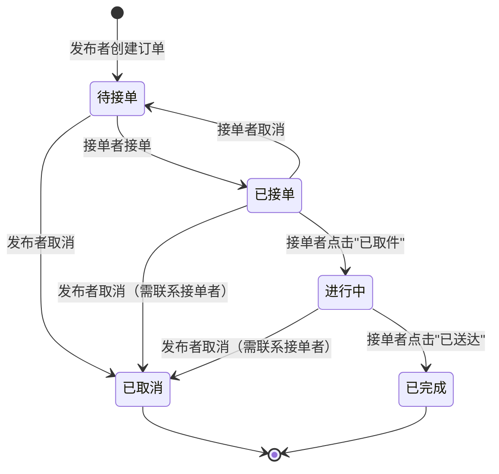

# 产品需求文档：校园代取系统 - V1.0

## 1. 综述 (Overview)

### 1.1 项目背景与核心问题

**背景：**
校园内存在大量代取快递、外卖的需求，同学们已自发建立多个代取微信群。但现有微信群模式存在三大痛点：
1. **价格不透明**：没有标准定价，每次都要单独沟通
2. **信息不对称**：需要加发布人微信才能获取具体信息
3. **效率低下**：顺路可取快递的同学无法及时接单，不知道任务是否已被接取

**核心问题：**
如何设计一个最小可用的系统，解决现有群的三大痛点，让同学们愿意从群迁移到系统。

**解决方案：**
开发一个校园代取系统，提供发布任务、浏览订单、接单、状态管理、取消订单等核心功能，实现价格透明化、信息公开化、状态实时更新。

### 1.2 核心业务流程 / 用户旅程地图

1. **阶段一：发布任务** - 用户发布代取需求，填写任务信息
2. **阶段二：接单匹配** - 接单者浏览订单并接单，双方获取联系方式
3. **阶段三：任务执行** - 接单者取件、送达，更新订单状态
4. **阶段四：订单完成/取消** - 订单完成或取消

### 1.3 Mermaid 图（流程/状态/时序）

#### 1.3.1 用户操作流（必填）

```mermaid
flowchart TD
  A[用户进入首页] --> B{选择操作}
  B -->|发布代取| C[进入发布页面]
  B -->|接取代取| D[进入订单列表页]

  C --> E[填写任务信息]
  E --> F[点击发布]
  F --> G{发布成功?}
  G -->|是| H[订单创建成功<br/>状态：待接单]
  G -->|否| I[显示错误提示<br/>如：必填项未填]

  D --> J[查看待接订单列表]
  J --> K[筛选订单<br/>距离/报酬/时间]
  K --> L[点击某个订单]
  L --> M[查看订单详情]
  M --> N{是否接单?}
  N -->|是| O[填写联系方式]
  O --> P[点击确认接单]
  P --> Q{接单成功?}
  Q -->|是| R[订单状态变为：已接单<br/>双方获取联系方式]
  Q -->|否| S[提示：订单已被接取]
  N -->|否| T[返回订单列表]

  R --> U[接单者取件]
  U --> V[接单者点击"已取件"]
  V --> W[订单状态变为：进行中]

  W --> X[接单者送达]
  X --> Y[接单者点击"已送达"]
  Y --> Z[订单状态变为：已完成]

  H --> AA{发布者取消?}
  AA -->|是| AB[点击取消订单]
  AB --> AC[确认取消]
  AC --> AD[订单状态变为：已取消]

  R --> AE{接单者取消?}
  AE -->|是| AF[点击取消接单]
  AF --> AG[确认取消]
  AG --> AH[订单状态恢复为：待接单]
```

#### 1.3.2 状态机（当存在明确状态流转对象时必填）



## 2. 用户故事详述 (User Stories)

### 阶段一：发布任务

---

#### **US-01: 作为需要代取快递/外卖的同学，我希望快速发布代取任务并填写必要信息，以便于让其他同学看到我的需求并接单。**

*   **价值陈述 (Value Statement)**:
    *   **作为** 需要代取快递/外卖的同学
    *   **我希望** 快速发布代取任务并填写必要信息
    *   **以便于** 让其他同学看到我的需求并接单

*   **业务规则与逻辑 (Business Logic)**:
    1.  **前置条件**: 用户已进入首页
    2.  **操作流程 (Happy Path)**:
        1. 用户在首页点击"发布代取"按钮
        2. 进入发布页面，看到表单
        3. 填写以下信息：
           - 任务类型（必填）：快递代取 / 外卖代取 / 其他跑腿
           - 取件地点（必填）：哪个快递点/商家
           - 送达地点（必填）：哪个宿舍楼/具体位置
           - 任务描述（必填）：快递单号后4位/外卖订单号等
           - 报酬金额（必填）：用户自己定价
           - 联系方式（必填）：微信/QQ
           - 期望时间（选填）：什么时候需要送达
           - 备注（选填）：其他补充说明
        4. 点击"发布"按钮
        5. 系统校验通过，订单创建成功
        6. 页面显示成功提示，订单状态变为"待接单"
    3.  **异常处理 (Error Handling)**:
        * 必填项未填写时，点击发布按钮无反应，并在对应字段下方显示红色提示"此项为必填"
        * 报酬金额输入非数字时，提示"请输入有效金额"
        * 发布失败时，显示"发布失败，请稍后重试"，保留已填写信息

*   **验收标准 (Acceptance Criteria)**:
    *   **场景1: 成功发布**
        *   **GIVEN** 用户在发布页面填写了所有必填项
        *   **WHEN** 用户点击"发布"按钮
        *   **THEN** 系统创建订单，状态为"待接单"，页面显示成功提示
    *   **场景2: 必填项未填**
        *   **GIVEN** 用户未填写"取件地点"
        *   **WHEN** 用户点击"发布"按钮
        *   **THEN** 系统不提交，在"取件地点"字段下方显示红色提示"此项为必填"

---
*   **页面布局线框图 (ASCII Wireframe)**:
    ```text
    +----------------------------------------------------------+
    |  发布代取任务                                    [返回]  |
    +----------------------------------------------------------+
    |                                                          |
    |  任务类型 *                                              |
    |  [ 快递代取 v ]                                          |
    |                                                          |
    |  取件地点 *                                              |
    |  [ 请输入快递点/商家名称              ]                  |
    |                                                          |
    |  送达地点 *                                              |
    |  [ 请输入宿舍楼/具体位置              ]                  |
    |                                                          |
    |  任务描述 *                                              |
    |  [ 请输入快递单号后4位/外卖订单号等    ]                  |
    |                                                          |
    |  报酬金额 *                                              |
    |  [ 请输入金额 ] 元                                       |
    |                                                          |
    |  联系方式 *                                              |
    |  [ 请输入微信/QQ                      ]                  |
    |                                                          |
    |  期望时间                                                |
    |  [ 请选择时间              ] [选择]                      |
    |                                                          |
    |  备注                                                    |
    |  [ 请输入其他补充说明（选填）        ]                  |
    |  +--------------------------------------------------+    |
    |  |                                                  |    |
    |  +--------------------------------------------------+    |
    |                                                          |
    |  ⚠️ 风险提示：交易双方需自行承担风险，请谨慎交易        |
    |                                                          |
    |  [ 取消 ]                          [ 发布 ]             |
    |                                                          |
    +----------------------------------------------------------+
    ```

---

### 阶段二：接单匹配

---

#### **US-02: 作为想要接单赚钱的同学，我希望快速浏览所有待接订单并进行筛选，以便于找到合适自己的订单并接单。**

*   **价值陈述 (Value Statement)**:
    *   **作为** 想要接单赚钱的同学
    *   **我希望** 快速浏览所有待接订单并进行筛选
    *   **以便于** 找到合适自己的订单并接单

*   **业务规则与逻辑 (Business Logic)**:
    1.  **前置条件**: 用户已进入首页
    2.  **操作流程 (Happy Path)**:
        1. 用户在首页点击"接取代取"按钮
        2. 进入订单列表页，看到所有"待接单"状态的订单
        3. 每个订单卡片显示：
           - 任务类型
           - 取件地点
           - 送达地点
           - 报酬金额
           - 期望时间（如有）
           - 发布时间
        4. 用户可以通过筛选器筛选订单：
           - 按任务类型筛选（快递代取/外卖代取/其他跑腿）
           - 按报酬金额排序（从高到低/从低到高）
           - 按发布时间排序（最新发布/最早发布）
        5. 用户点击某个订单卡片，进入订单详情页
    3.  **异常处理 (Error Handling)**:
        * 当前没有待接订单时，显示空状态："暂无待接订单，稍后再来看看吧"
        * 筛选后无结果时，显示："没有符合条件的订单"

*   **验收标准 (Acceptance Criteria)**:
    *   **场景1: 成功浏览订单列表**
        *   **GIVEN** 系统中有多个待接订单
        *   **WHEN** 用户进入订单列表页
        *   **THEN** 系统显示所有待接订单卡片，按发布时间倒序排列
    *   **场景2: 筛选订单**
        *   **GIVEN** 用户在订单列表页
        *   **WHEN** 用户选择"报酬从高到低"排序
        *   **THEN** 订单列表按报酬金额从高到低重新排列
    *   **场景3: 无待接订单**
        *   **GIVEN** 系统中没有待接订单
        *   **WHEN** 用户进入订单列表页
        *   **THEN** 显示空状态提示："暂无待接订单，稍后再来看看吧"

---
*   **页面布局线框图 (ASCII Wireframe)**:
    ```text
    +----------------------------------------------------------+
    |  待接订单列表                                    [返回]  |
    +----------------------------------------------------------+
    |  筛选条件:                                               |
    |  类型: [ 全部 v ]  排序: [ 最新发布 v ]                  |
    +----------------------------------------------------------+
    |                                                          |
    |  +----------------------------------------------------+  |
    |  | 快递代取 | 报酬: ¥5.00                             |  |
    |  +----------------------------------------------------+  |
    |  | 取件: 校外快递点A                                  |  |
    |  | 送达: 男生宿舍3号楼                                |  |
    |  | 期望: 今天 18:00 前                                |  |
    |  | 发布: 10分钟前                                     |  |
    |  +----------------------------------------------------+  |
    |                                                          |
    |  +----------------------------------------------------+  |
    |  | 外卖代取 | 报酬: ¥3.00                             |  |
    |  +----------------------------------------------------+  |
    |  | 取件: 校外美团外卖点                               |  |
    |  | 送达: 女生宿舍2号楼                                |  |
    |  | 期望: 今天 12:30 前                                |  |
    |  | 发布: 25分钟前                                     |  |
    |  +----------------------------------------------------+  |
    |                                                          |
    |  +----------------------------------------------------+  |
    |  | 快递代取 | 报酬: ¥8.00                             |  |
    |  +----------------------------------------------------+  |
    |  | 取件: 校外快递点B                                  |  |
    |  | 送达: 男生宿舍5号楼                                |  |
    |  | 期望: 今天 20:00 前                                |  |
    |  | 发布: 1小时前                                      |  |
    |  +----------------------------------------------------+  |
    |                                                          |
    |  [加载更多...]                                           |
    |                                                          |
    +----------------------------------------------------------+
    ```

---

#### **US-03: 作为想要接单赚钱的同学，我希望快速接取合适的订单并获取发布者联系方式，以便于与发布者联系并完成任务。**

*   **价值陈述 (Value Statement)**:
    *   **作为** 想要接单赚钱的同学
    *   **我希望** 快速接取合适的订单并获取发布者联系方式
    *   **以便于** 与发布者联系并完成任务

*   **业务规则与逻辑 (Business Logic)**:
    1.  **前置条件**: 用户已进入订单详情页
    2.  **操作流程 (Happy Path)**:
        1. 用户在订单列表页点击某个订单卡片
        2. 进入订单详情页，看到完整信息：
           - 任务类型
           - 取件地点
           - 送达地点
           - 任务描述
           - 报酬金额
           - 期望时间（如有）
           - 备注（如有）
           - 发布时间
        3. 用户点击"接单"按钮
        4. 弹出接单确认框，要求填写：
           - 接单者联系方式（必填）：微信/QQ
        5. 用户填写联系方式后，点击"确认接单"
        6. 系统校验订单状态仍为"待接单"
        7. 接单成功，订单状态变为"已接单"
        8. 页面显示发布者联系方式
        9. 显示风险提示："请通过联系方式与发布者沟通，自行完成交易"
    3.  **异常处理 (Error Handling)**:
        * 订单已被他人接取时，提示"该订单已被接取"，返回订单列表页
        * 联系方式未填写时，提示"请填写联系方式"
        * 接单失败时，提示"接单失败，请稍后重试"

*   **验收标准 (Acceptance Criteria)**:
    *   **场景1: 成功接单**
        *   **GIVEN** 用户在订单详情页，订单状态为"待接单"
        *   **WHEN** 用户填写联系方式并点击"确认接单"
        *   **THEN** 订单状态变为"已接单"，页面显示发布者联系方式
    *   **场景2: 订单已被接取**
        *   **GIVEN** 用户在订单详情页
        *   **WHEN** 订单已被他人接取
        *   **THEN** 提示"该订单已被接取"，自动返回订单列表页
    *   **场景3: 联系方式未填**
        *   **GIVEN** 用户点击"接单"按钮
        *   **WHEN** 用户未填写联系方式就点击"确认接单"
        *   **THEN** 提示"请填写联系方式"，不提交接单请求

---
*   **页面布局线框图 (ASCII Wireframe)**:

    **订单详情页：**
    ```text
    +----------------------------------------------------------+
    |  订单详情                                        [返回]  |
    +----------------------------------------------------------+
    |                                                          |
    |  任务类型: 快递代取                                      |
    |                                                          |
    |  取件地点: 校外快递点A                                   |
    |                                                          |
    |  送达地点: 男生宿舍3号楼                                 |
    |                                                          |
    |  任务描述: 快递单号后4位: 1234                           |
    |                                                          |
    |  报酬金额: ¥5.00                                         |
    |                                                          |
    |  期望时间: 今天 18:00 前                                 |
    |                                                          |
    |  备注: 快递有点重，麻烦小心轻放                          |
    |                                                          |
    |  发布时间: 2026-03-10 17:30                              |
    |                                                          |
    |  ⚠️ 风险提示：交易双方需自行承担风险，请谨慎交易        |
    |                                                          |
    |  [ 返回列表 ]                      [ 接单 ]             |
    |                                                          |
    +----------------------------------------------------------+
    ```

    **接单确认弹窗：**
    ```text
    +------------------------------------------+
    |  确认接单                          [×]  |
    +------------------------------------------+
    |                                          |
    |  请填写您的联系方式，以便发布者联系您    |
    |                                          |
    |  联系方式 *                              |
    |  [ 请输入微信/QQ            ]            |
    |                                          |
    |  ⚠️ 提交后订单将锁定，请及时联系发布者  |
    |                                          |
    |  [ 取消 ]          [ 确认接单 ]          |
    |                                          |
    +------------------------------------------+
    ```

    **接单成功页面：**
    ```text
    +----------------------------------------------------------+
    |  接单成功                                                |
    +----------------------------------------------------------+
    |                                                          |
    |  ✓ 接单成功！请及时联系发布者                            |
    |                                                          |
    |  发布者联系方式:                                         |
    |  微信: abc123                                            |
    |                                                          |
    |  订单状态: 已接单                                        |
    |                                                          |
    |  ⚠️ 请通过联系方式与发布者沟通，自行完成交易            |
    |                                                          |
    |  [ 返回订单列表 ]          [ 查看我的接单 ]             |
    |                                                          |
    +----------------------------------------------------------+
    ```

---

### 阶段三：任务执行

---

#### **US-04: 作为接单者，我希望更新订单状态（已取件/已送达），以便于让发布者知道任务进展。**

*   **价值陈述 (Value Statement)**:
    *   **作为** 接单者
    *   **我希望** 更新订单状态（已取件/已送达）
    *   **以便于** 让发布者知道任务进展

*   **业务规则与逻辑 (Business Logic)**:
    1.  **前置条件**: 接单者已成功接单，订单状态为"已接单"或"进行中"
    2.  **操作流程 (Happy Path)**:
        **场景A：标记已取件**
        1. 接单者进入"我的接单"页面
        2. 找到状态为"已接单"的订单
        3. 点击"已取件"按钮
        4. 订单状态变为"进行中"
        5. 页面显示成功提示

        **场景B：标记已送达**
        1. 接单者进入"我的接单"页面
        2. 找到状态为"进行中"的订单
        3. 点击"已送达"按钮
        4. 订单状态变为"已完成"
        5. 页面显示成功提示
    3.  **异常处理 (Error Handling)**:
        * 订单状态不是"已接单"时，"已取件"按钮不可点击
        * 订单状态不是"进行中"时，"已送达"按钮不可点击
        * 更新失败时，提示"操作失败，请稍后重试"

*   **验收标准 (Acceptance Criteria)**:
    *   **场景1: 标记已取件**
        *   **GIVEN** 接单者已接单，订单状态为"已接单"
        *   **WHEN** 接单者点击"已取件"按钮
        *   **THEN** 订单状态变为"进行中"，显示成功提示
    *   **场景2: 标记已送达**
        *   **GIVEN** 接单者已取件，订单状态为"进行中"
        *   **WHEN** 接单者点击"已送达"按钮
        *   **THEN** 订单状态变为"已完成"，显示成功提示
    *   **场景3: 状态不匹配**
        *   **GIVEN** 订单状态为"已完成"
        *   **WHEN** 接单者尝试点击"已取件"按钮
        *   **THEN** 按钮不可点击或隐藏

---
*   **页面布局线框图 (ASCII Wireframe)**:
    ```text
    +----------------------------------------------------------+
    |  我的接单                                        [返回]  |
    +----------------------------------------------------------+
    |                                                          |
    |  +----------------------------------------------------+  |
    |  | 快递代取 | 状态: 已接单                             |  |
    |  +----------------------------------------------------+  |
    |  | 取件: 校外快递点A                                  |  |
    |  | 送达: 男生宿舍3号楼                                |  |
    |  | 报酬: ¥5.00                                        |  |
    |  | 发布者联系方式: 微信 abc123                        |  |
    |  +----------------------------------------------------+  |
    |  | [ 已取件 ]                                         |  |
    |  +----------------------------------------------------+  |
    |                                                          |
    |  +----------------------------------------------------+  |
    |  | 外卖代取 | 状态: 进行中                            |  |
    |  +----------------------------------------------------+  |
    |  | 取件: 校外美团外卖点                               |  |
    |  | 送达: 女生宿舍2号楼                                |  |
    |  | 报酬: ¥3.00                                        |  |
    |  | 发布者联系方式: QQ 12345678                        |  |
    |  +----------------------------------------------------+  |
    |  | [ 已送达 ]                                         |  |
    |  +----------------------------------------------------+  |
    |                                                          |
    |  +----------------------------------------------------+  |
    |  | 快递代取 | 状态: 已完成                            |  |
    |  +----------------------------------------------------+  |
    |  | 取件: 校外快递点B                                  |  |
    |  | 送达: 男生宿舍5号楼                                |  |
    |  | 报酬: ¥8.00                                        |  |
    |  | 完成时间: 2026-03-10 19:30                         |  |
    |  +----------------------------------------------------+  |
    |                                                          |
    +----------------------------------------------------------+
    ```

---

### 阶段四：订单完成/取消

---

#### **US-05: 作为发布者或接单者，我希望在必要时取消订单，以便于释放订单资源或重新发布。**

*   **价值陈述 (Value Statement)**:
    *   **作为** 发布者或接单者
    *   **我希望** 在必要时取消订单
    *   **以便于** 释放订单资源或重新发布

*   **业务规则与逻辑 (Business Logic)**:
    1.  **前置条件**:
        - **发布者**：订单状态为"待接单"时可以取消
        - **接单者**：订单状态为"已接单"时可以取消
        - **已接单状态**：发布者无法取消，需联系接单者沟通
    2.  **操作流程 (Happy Path)**:
        **场景A：发布者取消待接单订单**
        1. 发布者进入"我的发布"页面
        2. 找到状态为"待接单"的订单
        3. 点击"取消订单"按钮
        4. 弹出确认框："确定要取消该订单吗？"
        5. 发布者点击"确认取消"
        6. 订单状态变为"已取消"
        7. 页面显示成功提示

        **场景B：接单者取消已接单订单**
        1. 接单者进入"我的接单"页面
        2. 找到状态为"已接单"的订单
        3. 点击"取消接单"按钮
        4. 弹出确认框："确定要取消接单吗？订单将重新开放给其他人接取"
        5. 接单者点击"确认取消"
        6. 订单状态恢复为"待接单"
        7. 页面显示成功提示

        **场景C：发布者查看已接单订单**
        1. 发布者进入"我的发布"页面
        2. 找到状态为"已接单"或"进行中"的订单
        3. 显示接单者联系方式
        4. 不显示"取消订单"按钮
        5. 显示提示："订单已被接取，如需取消请联系接单者"
    3.  **异常处理 (Error Handling)**:
        * 订单状态为"已完成"时，取消按钮不可点击
        * 取消失败时，提示"操作失败，请稍后重试"

*   **验收标准 (Acceptance Criteria)**:
    *   **场景1: 发布者取消待接单订单**
        *   **GIVEN** 发布者发布了订单，状态为"待接单"
        *   **WHEN** 发布者点击"取消订单"并确认
        *   **THEN** 订单状态变为"已取消"
    *   **场景2: 接单者取消已接单订单**
        *   **GIVEN** 接单者已接单，订单状态为"已接单"
        *   **WHEN** 接单者点击"取消接单"并确认
        *   **THEN** 订单状态恢复为"待接单"，其他用户可以接单
    *   **场景3: 发布者无法取消已接单订单**
        *   **GIVEN** 订单状态为"已接单"
        *   **WHEN** 发布者查看该订单
        *   **THEN** 不显示"取消订单"按钮，显示提示"订单已被接取，如需取消请联系接单者"

---
*   **页面布局线框图 (ASCII Wireframe)**:

    **我的发布页面：**
    ```text
    +----------------------------------------------------------+
    |  我的发布                                        [返回]  |
    +----------------------------------------------------------+
    |                                                          |
    |  +----------------------------------------------------+  |
    |  | 快递代取 | 状态: 待接单                             |  |
    |  +----------------------------------------------------+  |
    |  | 取件: 校外快递点A                                  |  |
    |  | 送达: 男生宿舍3号楼                                |  |
    |  | 报酬: ¥5.00                                        |  |
    |  | 发布时间: 2026-03-10 17:30                         |  |
    |  +----------------------------------------------------+  |
    |  | [ 取消订单 ]                                       |  |
    |  +----------------------------------------------------+  |
    |                                                          |
    |  +----------------------------------------------------+  |
    |  | 外卖代取 | 状态: 已接单                            |  |
    |  +----------------------------------------------------+  |
    |  | 取件: 校外美团外卖点                               |  |
    |  | 送达: 女生宿舍2号楼                                |  |
    |  | 报酬: ¥3.00                                        |  |
    |  | 接单者联系方式: 微信 xyz789                        |  |
    |  +----------------------------------------------------+  |
    |  | ℹ️ 订单已被接取，如需取消请联系接单者              |  |
    |  +----------------------------------------------------+  |
    |                                                          |
    |  +----------------------------------------------------+  |
    |  | 快递代取 | 状态: 进行中                            |  |
    |  +----------------------------------------------------+  |
    |  | 取件: 校外快递点B                                  |  |
    |  | 送达: 男生宿舍5号楼                                |  |
    |  | 报酬: ¥8.00                                        |  |
    |  | 接单者联系方式: QQ 12345678                        |  |
    |  +----------------------------------------------------+  |
    |  | ℹ️ 订单已被接取，如需取消请联系接单者              |  |
    |  +----------------------------------------------------+  |
    |                                                          |
    |  +----------------------------------------------------+  |
    |  | 快递代取 | 状态: 已完成                            |  |
    |  +----------------------------------------------------+  |
    |  | 取件: 校外快递点C                                  |  |
    |  | 送达: 女生宿舍1号楼                                |  |
    |  | 报酬: ¥6.00                                        |  |
    |  | 完成时间: 2026-03-10 19:30                         |  |
    |  +----------------------------------------------------+  |
    |                                                          |
    +----------------------------------------------------------+
    ```

    **取消确认弹窗（发布者）：**
    ```text
    +------------------------------------------+
    |  确认取消                          [×]  |
    +------------------------------------------+
    |                                          |
    |  确定要取消该订单吗？                    |
    |                                          |
    |  取消后订单将无法恢复                    |
    |                                          |
    |  [ 返回 ]          [ 确认取消 ]          |
    |                                          |
    +------------------------------------------+
    ```

    **取消确认弹窗（接单者）：**
    ```text
    +------------------------------------------+
    |  确认取消接单                      [×]  |
    +------------------------------------------+
    |                                          |
    |  确定要取消接单吗？                      |
    |                                          |
    |  订单将重新开放给其他人接取              |
    |                                          |
    |  [ 返回 ]          [ 确认取消 ]          |
    |                                          |
    +------------------------------------------+
    ```
